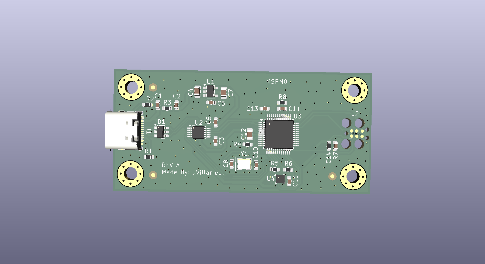
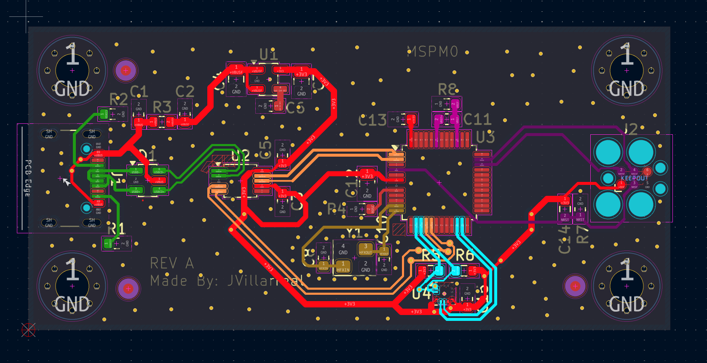
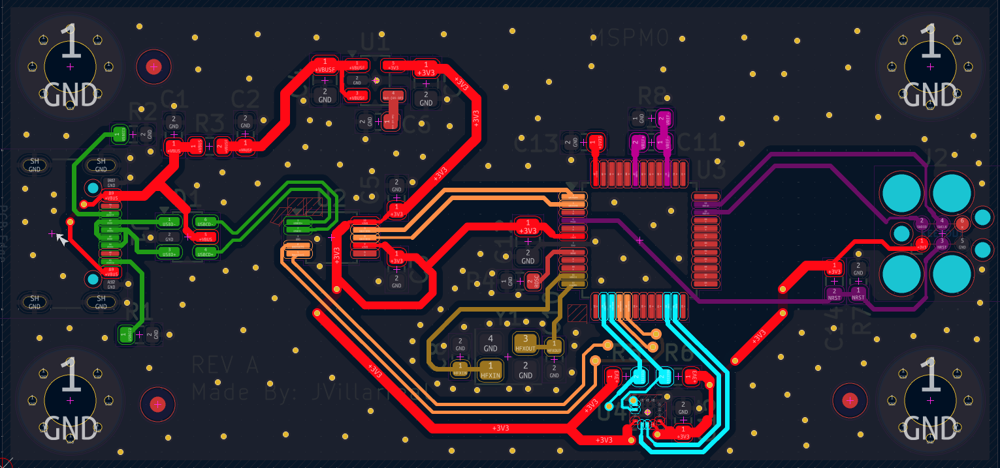
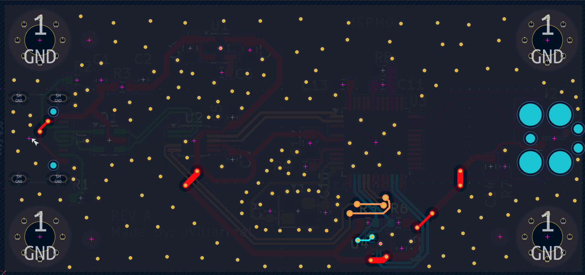

# MSPM0G3507 Development Board

custom 2-layer development board designed in KiCad.

## Features
- USB-C input with ESD protection (USBLC6-2SC6)
- 3.3V LDO power regulation (SPX3819)
- MSPM0G3507 ARM Cortex-M0+ MCU at 80MHz
- 8MHz external crystal oscillator
- CH340E USB-UART converter for PC communication
- LIS2DH accelerometer over I2C
- SWD debug interface (Tag-Connect)
- Ground plane on B.Cu

## Tools
- KiCad 10.0
- JLCPCB for fabrication

## Status
REV A — Design complete, awaiting fabrication.
Not final — known improvements for REV B:
- Shorten HFXIN crystal trace (currently 14mm, target <5mm)
- Review CC1/CC2 pull-down resistor values for USB-PD compatibility

### 3D View

### PCB Layout

### Top Layer

### Bottom Layer

